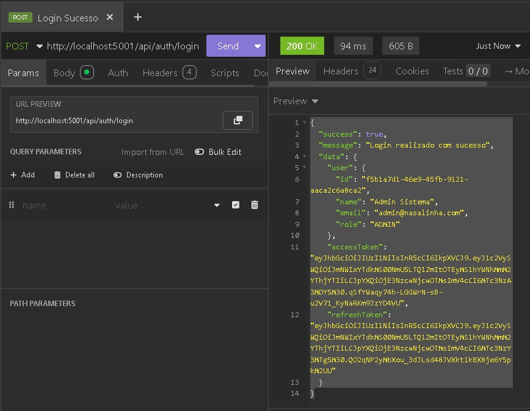

<<<<<<< HEAD
# 🚀 QA Portfolio — Projeto NaSalinha

**Matheus Fellipe Araujo Marques**
Ciência da Computação — UFLA
Desafio Trainee Comp Júnior 2026/1

---

## 📅 Cronograma do Desafio

### 🏗️ Semana 2: Setup e Infraestrutura
Configuração do ambiente e análise técnica do sistema.

**Ações Realizadas:**
- [x] Ambiente local rodando via **Docker Compose**.
- [x] Estruturação do repositório (Backend e Frontend integrados).
- [x] **Bug Identificado:** Necessidade de mapeamento da porta 5001.
=======
# 🚀 QA Audit Portfolio — Projeto NaSalinha

 Matheus Fellipe Araujo Marques
 Ciência da Computação — UFLA
 Trainee Comp Júnior 2026/1

---

## 📅 Cronograma de Auditoria

### 🏗️ Semana 2: Setup e Exploração
- [x] Configuração do ambiente local com **Docker Compose**.
- [x] Identificação de portas e infraestrutura. 
- [x] **Bug Encontrado:** Conflito de porta (necessário rodar em 5001).
>>>>>>> 2a3d23681d9da5f5283a2370babcaface19f3073

**Evidência de Ambiente:**

---

### 📋 Semana 3: Planejamento de Testes
<<<<<<< HEAD
Estratégia e cenários detalhados para as áreas core.

#### 🔑 Área Core 1: Autenticação JWT
| ID | Caso de Teste | Tipo | Resultado Esperado |
| :--- | :--- | :--- | :--- |
| **CT-AUTH-01** | Login com credenciais válidas | API | Status 200 OK e Token JWT |
| **CT-AUTH-02** | Login com senha incorreta | API | Status 401 Unauthorized |

**Validação de API (Token):**

#### 📸 Área Core 2: Check-in por Foto
* **CT-CHECK-01:** Enviar imagem válida e validar status `201 Created`.
* **CT-CHECK-02:** Tentar enviar check-in sem arquivo e validar bloqueio.

#### 🏆 Área Core 3: Sistema de Pontos
* **CT-PONTOS-01:** Validar se o endpoint `/api/rankings` reflete o novo check-in.
* **CT-PONTOS-02:** Validar integridade dos pontos após deleção de registro.
=======
Design dos casos de teste para as 3 áreas obrigatórias (Core).

#### 🔑 Área Core 1: Autenticação JWT
| ID | Cenário | Resultado Esperado |
| :--- | :--- | :--- |
| **CT-AUTH-01** | Login com credenciais válidas | Status 200 OK e recebimento do Token |
| **CT-AUTH-02** | Login com senha incorreta | Status 401 Unauthorized |

**Validação de API (Login Sucesso):**

#### 📸 Área Core 2: Check-in por Foto
* **CT-CHECK-01:** Envio de imagem válida e validação de status 201 no backend.
* **CT-CHECK-02:** Teste de bloqueio ao tentar enviar formulário sem imagem.

#### 🏆 Área Core 3: Sistema de Pontos
* **CT-PONTOS-01:** Validação da atualização do ranking após aprovação do check-in.
* **CT-PONTOS-02:** Teste de regressão para garantir integridade dos cálculos.
>>>>>>> 2a3d23681d9da5f5283a2370babcaface19f3073

---

## 🐞 Gestão de Falhas
<<<<<<< HEAD
Documentação de bugs encontrados:
* **[Acessar Issues do Projeto](https://github.com/Straffey/QA-Portfolio-NaSalinha/issues)**

---

## ⏩ Próximos Passos
* Execução dos scripts de teste (Semana 4 e 5).
* Re-teste de bugs e validação de correções (Semana 6). 
=======
Documentação de bugs críticos na aba **[Issues](https://github.com/Straffey/QA-Portfolio-NaSalinha/issues)**.
>>>>>>> 2a3d23681d9da5f5283a2370babcaface19f3073
