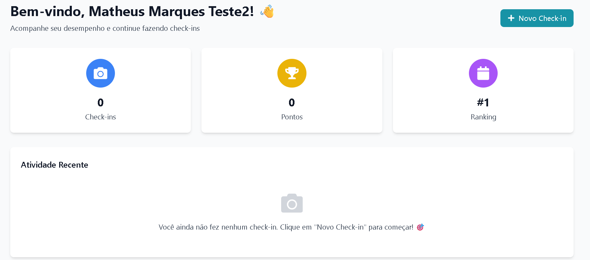

# Auditoria de QA - Projeto NaSalinha (Matheus Marques)

Este repositório contém a documentação da auditoria de qualidade realizada durante o Desafio 2026/1.

# Progresso - Semana 2
- [x] Configuração do ambiente local (Docker)
- [x] Integração com Mailtrap para testes de e-mail
- [x] Integração com Cloudinary para armazenamento de mídia
- [x] Setup do banco de dados (Prisma/PostgreSQL)

# Tecnologias
- Docker
- Mailtrap
- Cloudinary
- Insomnia
- Vs Code

#  Evidências de Setup
